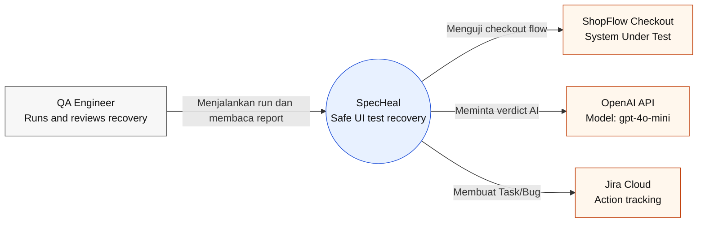
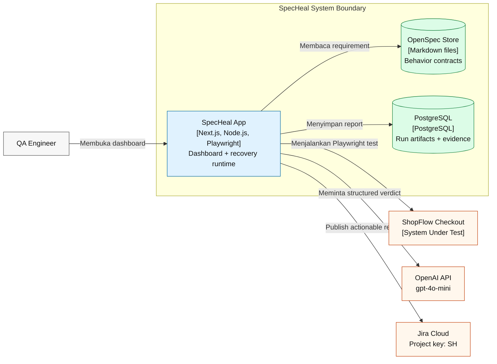
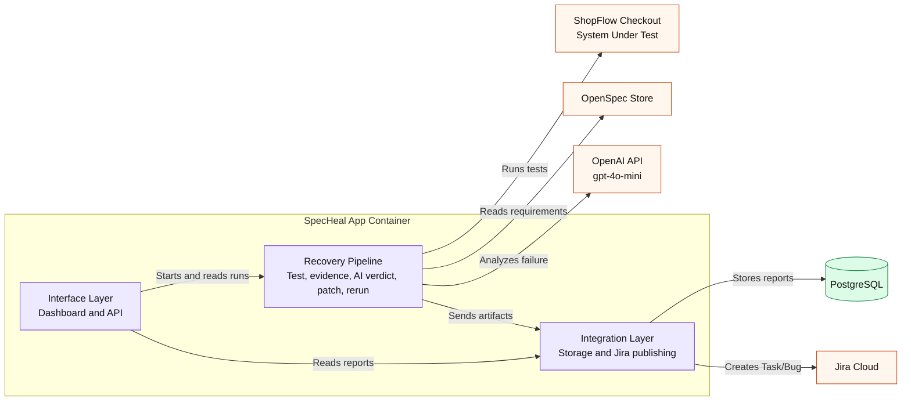
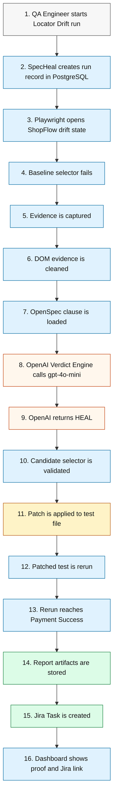
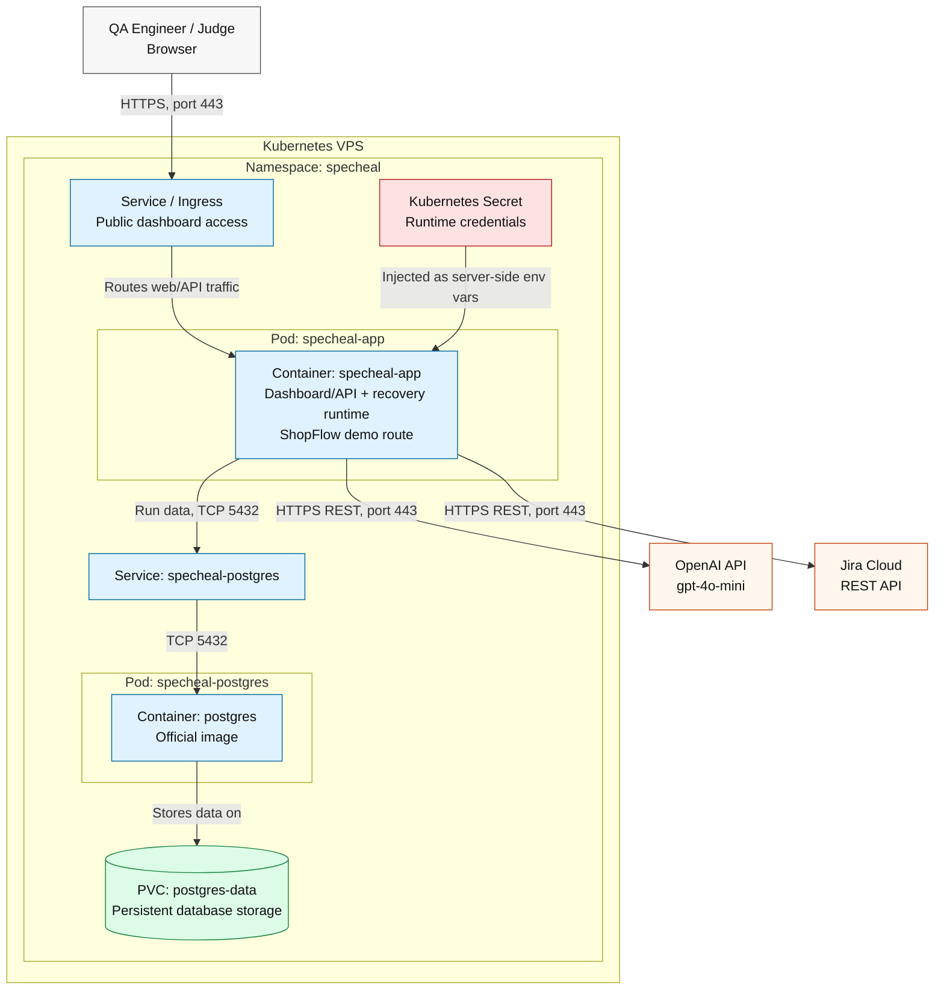

# SpecHeal C4 Architecture Model

Status: Draft planning  
Tim: Merge Kalau Berani  
Event: Refactory Hackathon 2026, Telkom Round  
Scope: MVP SpecHeal untuk ShopFlow Checkout recovery demo

## 1. Cara Membaca Dokumen

Dokumen ini memakai pendekatan C4 Model untuk menjelaskan arsitektur SpecHeal dari level bisnis sampai runtime deployment.

Diagram yang dibuat sekarang:

1. C1 System Context
2. C2 Container
3. C3 Component Overview
4. C3 Component Detail
5. Dynamic Diagram: Locator Drift HEAL Flow
6. Deployment Diagram: Kubernetes VPS

C4 Code diagram belum dibuat karena struktur code final belum stabil. Setelah implementasi utama selesai, diagram code bisa ditambahkan untuk komponen paling berisiko, misalnya `Patch Applicator` atau `OpenAI Verdict Engine`.

Catatan format:

- Diagram memakai Mermaid `flowchart` dengan gaya C4-like agar mudah dirender di Markdown.
- Istilah seperti container, component, runner, verdict, dan rerun proof dipertahankan karena lebih natural untuk konteks teknis.
- ShopFlow Checkout digambar sebagai target system secara logis, meskipun pada MVP route ShopFlow ikut berjalan di app container yang sama.

## 2. C1 - System Context

Diagram ini menunjukkan SpecHeal sebagai satu software system dan hubungan utamanya dengan actor serta external system.

Keputusan penting:

- Actor utama MVP adalah QA Engineer. Judge dan mentor tetap dibahas di PRD sebagai evaluator hackathon, tetapi tidak ditampilkan sebagai product actor di C1.
- OpenAI adalah core verdict engine, bukan optional fallback.
- Jira Cloud adalah output workflow untuk hasil yang butuh action.
- ShopFlow diposisikan sebagai target system supaya jelas bahwa SpecHeal sedang memulihkan test terhadap aplikasi target.

## 3. C2 - Container

Diagram ini menjelaskan container logis di dalam SpecHeal. Dalam C4, container berarti unit aplikasi atau data store, bukan selalu Docker container.

Keputusan penting:

- App MVP dijalankan sebagai satu app container agar deployment cepat dan sederhana.
- ShopFlow berada di luar boundary karena perannya adalah System Under Test, tetapi pada deployment MVP tetap co-located di app container yang sama.
- OpenSpec digambar sebagai file store karena bukan service yang runnable.
- PostgreSQL adalah data store milik SpecHeal dan menyimpan screenshot sebagai base64 untuk MVP.
- Jira project key `SH` dicatat sebagai konfigurasi target, bukan hardcoded di arsitektur.

## 4. C3 - Component Overview: SpecHeal App Container

This diagram shows the main component groups inside the `SpecHeal App Container`. It is intended as the first C3 view before reading the detailed component diagram.

This overview intentionally hides implementation detail. The detailed C3 diagram below expands each group into concrete components.

## 5. C3 - Component Detail: SpecHeal App Container

Diagram ini melakukan zoom-in detail ke `SpecHeal App Container`.

```mermaid
flowchart LR
  subgraph app["SpecHeal App Container"]
    subgraph interface["Interface"]
      dashboard["Dashboard UI<br/>[React / Next.js]<br/>Run + report UI"]
      runApi["Run API<br/>[Next.js API Route]<br/>Run/report endpoints"]
    end

    subgraph recovery["Recovery Pipeline"]
      orchestrator["Run Orchestrator<br/>[TypeScript]<br/>Controls run state"]
      playwright["Playwright Runner<br/>[Playwright, Chromium]<br/>Runs browser test"]
      evidence["Evidence Collector<br/>[Playwright]<br/>Captures failure data"]
      domCleaner["DOM Cleaner<br/>[TypeScript]<br/>Cleans AI evidence"]
      openspecLoader["OpenSpec Loader<br/>[Markdown files]<br/>Loads clauses"]
      verdictEngine["OpenAI Verdict Engine<br/>[OpenAI SDK, gpt-4o-mini]<br/>Returns verdict"]
      validator["Candidate Validator<br/>[Playwright]<br/>Checks selector safety"]
      patcher["Patch Applicator<br/>[TypeScript]<br/>Applies locator patch"]
      rerun["Rerun Proof Engine<br/>[Playwright, Chromium]<br/>Proves patched test"]
    end

    subgraph integration["Persistence & Integration"]
      jiraPublisher["Jira Publisher<br/>[Jira REST API v3, ADF]<br/>Creates Task/Bug"]
      repository["Run Repository<br/>[TypeScript, SQL/ORM adapter]<br/>Stores artifacts"]
    end
  end

  shopflow["ShopFlow Checkout<br/>System Under Test"]
  openspec["OpenSpec Store"]
  postgres[("PostgreSQL")]
  openai["OpenAI API<br/>gpt-4o-mini"]
  jira["Jira Cloud"]

  dashboard -->|"Start run / cek report"| runApi
  runApi -->|"Buat job"| orchestrator
  orchestrator -->|"Run baseline test"| playwright
  playwright -->|"Jalankan browser test"| shopflow
  playwright -->|"Saat test gagal"| evidence
  evidence -->|"Bersihkan DOM"| domCleaner
  orchestrator -->|"Ambil requirement"| openspecLoader
  openspecLoader -->|"Baca OpenSpec"| openspec
  domCleaner -->|"Kirim evidence"| verdictEngine
  openspecLoader -->|"Kirim requirement"| verdictEngine
  verdictEngine -->|"Analisis failure"| openai
  verdictEngine -->|"Candidate HEAL"| validator
  validator -->|"Candidate aman"| patcher
  patcher -->|"Patch test file"| rerun
  rerun -->|"Rerun test"| shopflow
  verdictEngine -->|"Bug/spec/error"| jiraPublisher
  rerun -->|"HEAL terbukti"| jiraPublisher
  jiraPublisher -->|"Buat Task/Bug"| jira
  orchestrator -->|"Simpan state"| repository
  evidence -->|"Simpan evidence"| repository
  verdictEngine -->|"Simpan AI trace"| repository
  patcher -->|"Simpan patch"| repository
  rerun -->|"Simpan proof"| repository
  jiraPublisher -->|"Simpan Jira result"| repository
  repository -->|"Read/write"| postgres
  runApi -->|"Ambil report"| repository

  classDef component fill:#ede9fe,stroke:#6d28d9,color:#111;
  classDef core fill:#fef3c7,stroke:#b45309,color:#111;
  classDef datastore fill:#dcfce7,stroke:#15803d,color:#111;
  classDef external fill:#fff7ed,stroke:#c2410c,color:#111;

  class dashboard,runApi,orchestrator,playwright,evidence,domCleaner,openspecLoader,verdictEngine,validator,repository,jiraPublisher,rerun component;
  class patcher core;
  class postgres datastore;
  class shopflow,openspec,openai,jira external;
```

Komponen yang paling penting untuk inovasi:

- `OpenAI Verdict Engine`: menghasilkan verdict terstruktur dari evidence dan OpenSpec.
- `Candidate Validator`: memastikan AI candidate aman secara browser-level.
- `Patch Applicator`: menerapkan patch locator ke test file secara controlled.
- `Rerun Proof Engine`: membuktikan test yang sudah dipatch benar-benar mencapai `Payment Success`.
- `Jira Publisher`: mengubah hasil terminal menjadi workflow action.

## 6. Dynamic Diagram - Locator Drift HEAL Flow

Diagram ini menjelaskan urutan runtime untuk scenario paling penting: selector lama gagal, behavior masih benar, lalu SpecHeal melakukan safe heal.

Kenapa dynamic diagram fokus ke Locator Drift:

- Ini flow paling kaya untuk demo.
- Flow ini memperlihatkan seluruh mekanisme: evidence, OpenSpec, OpenAI, validation, patch, rerun, persistence, Jira.
- Product Bug flow lebih sederhana karena berhenti di report dan Jira Bug tanpa patch.

## 7. Deployment Diagram - Kubernetes VPS

Diagram ini menjelaskan bentuk runtime MVP di Kubernetes. App dan database tidak digabung dalam satu Docker image.

Deployment decisions:

- `specheal-app` adalah satu app container untuk MVP agar deployment cepat.
- PostgreSQL memakai official image sebagai pod/service terpisah.
- PVC dipakai agar data PostgreSQL tidak hilang saat pod restart.
- Kubernetes Secret menyimpan credential dan runtime config: `OPENAI_API_KEY`, `OPENAI_MODEL`, Jira config, dan `DATABASE_URL`. Secret tidak boleh muncul di client, report JSON, atau Jira issue body.
- ShopFlow route ikut di `specheal-app` untuk MVP, tetapi tetap diposisikan sebagai target system secara logis di C1/C2.

## 8. Architecture Notes

### 8.1 Actionable Jira Results

SpecHeal hanya membuat Jira issue untuk terminal result yang butuh action:

| Result | Jira Output |
| --- | --- |
| `NO_HEAL_NEEDED` | Tidak membuat issue secara default |
| `HEAL` | Task untuk review/apply patch |
| `PRODUCT BUG` | Bug untuk memperbaiki product regression |
| `SPEC OUTDATED` | Task untuk update test/spec mapping |
| Operational error | Task untuk investigasi runtime/config |

### 8.2 Evidence Storage

Untuk MVP, screenshot disimpan sebagai base64 di PostgreSQL. Ini dipilih karena demo scope kecil dan paling cepat diimplementasikan. Setelah MVP, evidence dapat dipindahkan ke object storage atau attachment Jira jika dibutuhkan.

### 8.3 Why No C4 Code Diagram Yet

C4 Code diagram sengaja ditunda karena code final belum stabil. Membuatnya terlalu awal berisiko menghasilkan diagram yang cepat salah setelah implementasi paralel berjalan.

Kandidat C4 Code setelah app stabil:

- `Patch Applicator`
- `OpenAI Verdict Engine`
- `Jira Publisher`

## 9. References

- C4 Model: https://c4model.com/
- C4 Diagrams: https://c4model.com/diagrams
- Mermaid Flowchart Syntax: https://mermaid.js.org/syntax/flowchart.html
